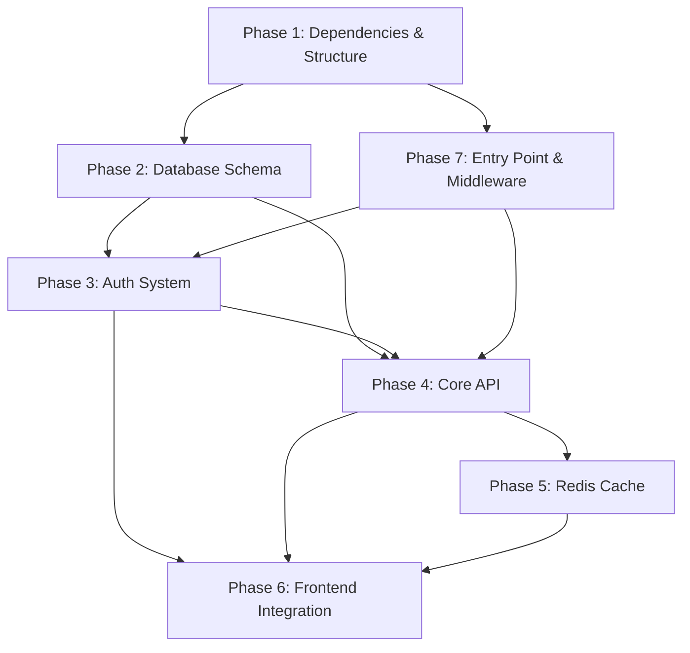

# Quizzo — Full-Stack Implementation Plan

## Overview

Transform Quizzo from a **frontend-only app** (all data in `localStorage`, hardcoded questions, mock auth) into a **production-ready full-stack application** with a PostgreSQL database, Redis cache layer, JWT authentication, and a proper REST API.

### Current State Summary

| Layer | Status | Details |
|-------|--------|---------|
| **Frontend** | ✅ UI Design Complete | React + Vite + Tailwind v4 + ShadCN. Pages: Landing, Auth, Dashboard, Quiz. All logic uses `localStorage`. |
| **Backend** | ⚠️ Skeleton Only | Express v5, only a `/health` endpoint exists. No routes, models, or middleware. |
| **Database** | ❌ Not Started | Supabase PostgreSQL credentials configured in `.env` but never used. |
| **Cache** | ❌ Not Started | Upstash Redis credentials configured in `.env` but never used. |
| **Storage** | ❌ Not Started | Supabase S3 credentials configured in `.env` but never used. |

---

## User Review Required

> [!IMPORTANT]
> **ORM Choice**: This plan uses **Prisma** as the ORM for PostgreSQL. It provides type-safe queries, auto-generated migrations, and an intuitive schema language. If you prefer **Drizzle ORM** or raw `pg` queries instead, let me know.

> [!IMPORTANT]
> **Auth Strategy**: This plan uses **JWT (JSON Web Tokens)** with httpOnly cookies for session management, plus bcrypt for password hashing. If you prefer session-based auth with express-session or an OAuth provider (Google, GitHub), let me know.

> [!IMPORTANT]
> **Question Management**: Currently, questions are hardcoded in the frontend. This plan moves them to the database and provides a **seed script** to populate initial data. For a future phase, an admin panel could be added for CRUD operations on questions. Should I include admin endpoints now?

---

## Open Questions

> [!IMPORTANT]
> 1. **User Roles**: Should the system support roles (e.g., `admin`, `student`, `teacher`)? This affects the schema and API middleware design.
> 2. **Question Images**: Do questions need to support image attachments (using Supabase S3 storage), or is text-only sufficient for now?
> 3. **Leaderboard Scope**: Should the leaderboard be global, per-subject, or both?
> 4. **Password Reset**: Should we implement email-based password reset in this phase, or defer to a future iteration?
> 5. **Rate Limiting**: Should we add rate limiting on auth endpoints to prevent brute-force attacks?

---

## Proposed Changes

The implementation is organized into **7 phases**, each building on the previous one.

---

### Phase 1 — Backend Foundation & Dependencies

Install all required backend packages and set up the project structure with proper separation of concerns.

#### [MODIFY] [package.json](file:///d:/final_year_project/backend/package.json)

Add the following dependencies:

```
Production:
  prisma client   → @prisma/client (ORM for PostgreSQL)
  bcryptjs        → password hashing
  jsonwebtoken    → JWT token generation/verification
  cookie-parser   → parse httpOnly cookies
  cors            → cross-origin requests from frontend
  dotenv          → environment variable loading
  @upstash/redis  → Redis cache client
  helmet          → security headers
  express-rate-limiter → rate limiting (optional)
  zod             → request validation

Dev:
  prisma          → schema management & migrations
```

#### [NEW] Backend folder structure

```
backend/
├── prisma/
│   ├── schema.prisma          ← database schema
│   ├── seed.js                ← seed script for questions/subjects
│   └── migrations/            ← auto-generated
├── src/
│   ├── config/
│   │   ├── db.js              ← Prisma client singleton
│   │   ├── redis.js           ← Upstash Redis client
│   │   └── env.js             ← validated env vars
│   ├── middleware/
│   │   ├── auth.js            ← JWT verification middleware
│   │   ├── validate.js        ← Zod validation middleware
│   │   └── errorHandler.js    ← global error handler
│   ├── routes/
│   │   ├── auth.routes.js     ← register, login, logout, me
│   │   ├── subject.routes.js  ← subjects & topics listing
│   │   ├── quiz.routes.js     ← start quiz, submit, results
│   │   ├── user.routes.js     ← profile, progress, stats
│   │   └── leaderboard.routes.js ← rankings
│   ├── services/
│   │   ├── auth.service.js    ← auth business logic
│   │   ├── quiz.service.js    ← quiz orchestration logic
│   │   ├── cache.service.js   ← Redis caching helpers
│   │   └── user.service.js    ← user/progress business logic
│   └── utils/
│       ├── jwt.js             ← token sign/verify helpers
│       ├── password.js        ← hash/compare helpers
│       └── apiResponse.js     ← standardized response format
├── index.js                   ← (modified) app entry with middleware
├── healthCheck.js             ← (keep existing)
├── .env                       ← (already exists)
└── package.json
```

---

### Phase 2 — Database Schema & Migrations (Prisma + Supabase PostgreSQL)

Design and create the database schema. This is the core data model that everything else depends on.

#### [NEW] [schema.prisma](file:///d:/final_year_project/backend/prisma/schema.prisma)

```prisma
generator client {
  provider = "prisma-client-js"
}

datasource db {
  provider = "postgresql"
  url      = env("DATABASE_URL")
}

model User {
  id           String    @id @default(cuid())
  username     String    @unique
  email        String    @unique
  passwordHash String
  avatarUrl    String?
  createdAt    DateTime  @default(now())
  updatedAt    DateTime  @updatedAt

  quizAttempts QuizAttempt[]
  progress     UserProgress[]

  @@map("users")
}

model Subject {
  id        String   @id @default(cuid())
  name      String   @unique
  icon      String                    // emoji or icon identifier
  sortOrder Int      @default(0)
  createdAt DateTime @default(now())

  topics    Topic[]

  @@map("subjects")
}

model Topic {
  id        String   @id @default(cuid())
  name      String
  subjectId String
  sortOrder Int      @default(0)
  createdAt DateTime @default(now())

  subject   Subject  @relation(fields: [subjectId], references: [id], onDelete: Cascade)
  questions Question[]
  quizAttempts QuizAttempt[]
  progress  UserProgress[]

  @@unique([subjectId, name])
  @@map("topics")
}

enum QuestionType {
  mcq
  tf
  match
}

enum DifficultyLevel {
  Basic
  Intermediate
  Advanced
  Final
}

model Question {
  id          String          @id @default(cuid())
  topicId     String
  type        QuestionType
  difficulty  DifficultyLevel
  question    String                   // the question text
  options     Json?                    // string[] for MCQ, null for others
  answer      Json                     // string for MCQ, boolean for TF, Record<string,string> for match
  pairs       Json?                    // {left,right}[] for match type
  explanation String          @default("")
  createdAt   DateTime        @default(now())

  topic       Topic           @relation(fields: [topicId], references: [id], onDelete: Cascade)
  responses   QuestionResponse[]

  @@map("questions")
}

model QuizAttempt {
  id          String          @id @default(cuid())
  userId      String
  topicId     String
  level       DifficultyLevel
  score       Int
  totalQs     Int
  percentage  Float
  durationSec Int?
  startedAt   DateTime        @default(now())
  completedAt DateTime?

  user      User              @relation(fields: [userId], references: [id], onDelete: Cascade)
  topic     Topic             @relation(fields: [topicId], references: [id], onDelete: Cascade)
  responses QuestionResponse[]

  @@map("quiz_attempts")
}

model QuestionResponse {
  id            String      @id @default(cuid())
  attemptId     String
  questionId    String
  userAnswer    Json
  isCorrect     Boolean
  answeredAt    DateTime    @default(now())

  attempt       QuizAttempt @relation(fields: [attemptId], references: [id], onDelete: Cascade)
  question      Question    @relation(fields: [questionId], references: [id], onDelete: Cascade)

  @@map("question_responses")
}

model UserProgress {
  id        String          @id @default(cuid())
  userId    String
  topicId   String
  level     DifficultyLevel
  completed Boolean         @default(false)
  bestScore Float?                    // best percentage achieved
  updatedAt DateTime        @updatedAt

  user      User            @relation(fields: [userId], references: [id], onDelete: Cascade)
  topic     Topic           @relation(fields: [topicId], references: [id], onDelete: Cascade)

  @@unique([userId, topicId, level])
  @@map("user_progress")
}
```

#### [NEW] [seed.js](file:///d:/final_year_project/backend/prisma/seed.js)

- Migrates the hardcoded questions from `frontend/src/app/data.ts` and `QuizPage.tsx` into the database
- Creates subjects: Mathematics, Science, Computer Science (from `data.ts`) + Technology, Literature (from `Dashboard.tsx`)
- Populates topics and their questions at each difficulty level

---

### Phase 3 — Authentication System

Build complete auth with JWT tokens, bcrypt password hashing, and httpOnly cookie-based sessions.

#### [NEW] [src/utils/password.js](file:///d:/final_year_project/backend/src/utils/password.js)
- `hashPassword(plain)` → bcryptjs hash with salt rounds = 12
- `comparePassword(plain, hash)` → bcryptjs compare

#### [NEW] [src/utils/jwt.js](file:///d:/final_year_project/backend/src/utils/jwt.js)
- `signToken(payload)` → signs JWT with `JWT_SECRET` env var, 7-day expiry
- `verifyToken(token)` → verifies and returns decoded payload
- Payload structure: `{ userId, email }`

#### [NEW] [src/middleware/auth.js](file:///d:/final_year_project/backend/src/middleware/auth.js)
- Extracts JWT from `Authorization: Bearer <token>` header OR from httpOnly cookie
- Verifies token, attaches `req.user = { userId, email }` to request
- Returns `401 Unauthorized` if invalid/missing

#### [NEW] [src/routes/auth.routes.js](file:///d:/final_year_project/backend/src/routes/auth.routes.js)

| Method | Endpoint | Auth | Description |
|--------|----------|------|-------------|
| `POST` | `/api/auth/register` | ❌ | Create account (username, email, password) |
| `POST` | `/api/auth/login` | ❌ | Login (email, password) → returns JWT |
| `POST` | `/api/auth/logout` | ✅ | Clear auth cookie |
| `GET` | `/api/auth/me` | ✅ | Get current user profile |

#### [NEW] [src/services/auth.service.js](file:///d:/final_year_project/backend/src/services/auth.service.js)
- Registration: validate input → check duplicate email/username → hash password → create user → sign JWT
- Login: validate input → find user by email → compare password → sign JWT
- Me: fetch user by ID from JWT payload (cache in Redis for 5 min)

---

### Phase 4 — Core API Endpoints

#### [NEW] [src/routes/subject.routes.js](file:///d:/final_year_project/backend/src/routes/subject.routes.js)

| Method | Endpoint | Auth | Description |
|--------|----------|------|-------------|
| `GET` | `/api/subjects` | ✅ | List all subjects with topic counts |
| `GET` | `/api/subjects/:id` | ✅ | Get subject with topics and user progress |
| `GET` | `/api/subjects/:id/topics/:topicId` | ✅ | Get topic detail with level info |

#### [NEW] [src/routes/quiz.routes.js](file:///d:/final_year_project/backend/src/routes/quiz.routes.js)

| Method | Endpoint | Auth | Description |
|--------|----------|------|-------------|
| `POST` | `/api/quiz/start` | ✅ | Start a quiz → returns questions (body: `{topicId, level}`) |
| `POST` | `/api/quiz/submit` | ✅ | Submit completed quiz (body: `{attemptId, responses[]}`) |
| `GET` | `/api/quiz/attempts` | ✅ | Get user's quiz history |
| `GET` | `/api/quiz/attempts/:id` | ✅ | Get specific attempt with responses |

**Quiz Flow:**
1. Frontend calls `POST /api/quiz/start` → backend creates a `QuizAttempt` record, selects questions for the topic+level, returns them (without answers)
2. User answers questions on frontend
3. Frontend calls `POST /api/quiz/submit` → backend grades answers server-side, calculates score, updates `QuizAttempt`, updates `UserProgress` if passed (≥60%)
4. Backend returns the graded result with explanations

> [!IMPORTANT]
> **Anti-cheat**: Answers are never sent to the frontend during the quiz. The backend only returns questions without the `answer` field. Grading happens server-side on submit.

#### [NEW] [src/routes/user.routes.js](file:///d:/final_year_project/backend/src/routes/user.routes.js)

| Method | Endpoint | Auth | Description |
|--------|----------|------|-------------|
| `GET` | `/api/user/profile` | ✅ | Full profile with stats |
| `PATCH` | `/api/user/profile` | ✅ | Update username, avatar |
| `GET` | `/api/user/progress` | ✅ | All progress across subjects/topics |
| `GET` | `/api/user/stats` | ✅ | Aggregated stats (total score, quizzes taken, avg score, streak) |
| `GET` | `/api/user/performance` | ✅ | Performance over time (for the chart) |

#### [NEW] [src/routes/leaderboard.routes.js](file:///d:/final_year_project/backend/src/routes/leaderboard.routes.js)

| Method | Endpoint | Auth | Description |
|--------|----------|------|-------------|
| `GET` | `/api/leaderboard` | ✅ | Global top 50 users by total score |
| `GET` | `/api/leaderboard/:subjectId` | ✅ | Subject-specific leaderboard |

---

### Phase 5 — Redis Cache Layer (Upstash)

#### [NEW] [src/config/redis.js](file:///d:/final_year_project/backend/src/config/redis.js)
- Initialize Upstash Redis client using `UPSTASH_REDIS_REST_URL` and `UPSTASH_REDIS_REST_TOKEN`
- Export singleton client instance

#### [NEW] [src/services/cache.service.js](file:///d:/final_year_project/backend/src/services/cache.service.js)

**Caching strategy:**

| Data | Cache Key Pattern | TTL | Invalidation |
|------|-------------------|-----|--------------|
| Subject list | `subjects:all` | 1 hour | On subject CRUD |
| Topic questions | `questions:{topicId}:{level}` | 30 min | On question CRUD |
| User profile | `user:{userId}` | 5 min | On profile update |
| User progress | `progress:{userId}` | 5 min | On quiz submit |
| Leaderboard (global) | `leaderboard:global` | 2 min | On quiz submit |
| Leaderboard (subject) | `leaderboard:{subjectId}` | 2 min | On quiz submit |
| User performance chart | `performance:{userId}` | 10 min | On quiz submit |

**Helper functions:**
- `cacheGet(key)` → get cached JSON
- `cacheSet(key, data, ttlSeconds)` → set with expiry
- `cacheDelete(key)` → explicit invalidation
- `cacheDeletePattern(pattern)` → invalidate by prefix (e.g., `progress:*`)

---

### Phase 6 — Frontend API Integration

Replace all `localStorage` logic with real API calls. This is the largest change on the frontend side.

#### [NEW] [src/app/services/api.ts](file:///d:/final_year_project/frontend/src/app/services/api.ts)
- Axios/fetch wrapper with base URL pointing to `http://localhost:4000/api`
- Automatic JWT token attachment (from cookie or stored token)
- Response interceptors for 401 → redirect to auth
- Typed API functions:
  ```ts
  // Auth
  api.auth.register(data) → POST /auth/register
  api.auth.login(data) → POST /auth/login
  api.auth.logout() → POST /auth/logout
  api.auth.me() → GET /auth/me

  // Subjects
  api.subjects.list() → GET /subjects
  api.subjects.get(id) → GET /subjects/:id

  // Quiz
  api.quiz.start(topicId, level) → POST /quiz/start
  api.quiz.submit(attemptId, responses) → POST /quiz/submit
  api.quiz.history() → GET /quiz/attempts

  // User
  api.user.profile() → GET /user/profile
  api.user.updateProfile(data) → PATCH /user/profile
  api.user.progress() → GET /user/progress
  api.user.stats() → GET /user/stats
  api.user.performance() → GET /user/performance

  // Leaderboard
  api.leaderboard.global() → GET /leaderboard
  ```

#### [NEW] [src/app/context/AuthContext.tsx](file:///d:/final_year_project/frontend/src/app/context/AuthContext.tsx)
- React Context + Provider for auth state
- Stores current user, loading state, auth methods
- On mount: calls `api.auth.me()` to restore session
- Provides: `user`, `isAuthenticated`, `isLoading`, `login()`, `register()`, `logout()`

#### [MODIFY] [AuthPage.tsx](file:///d:/final_year_project/frontend/src/app/components/AuthPage.tsx)
- Replace `localStorage` auth calls with `useAuth().login()` / `useAuth().register()`
- Remove all `localStorage.getItem("quizzo_users")` and `localStorage.getItem("quizzo_user")` references
- Use AuthContext for state

#### [MODIFY] [Dashboard.tsx](file:///d:/final_year_project/frontend/src/app/components/Dashboard.tsx)
- Replace hardcoded `SUBJECTS` array with API-fetched subjects: `api.subjects.list()`
- Replace mock `chartData` with real performance data: `api.user.performance()`
- Replace `localStorage` user with `useAuth().user`
- Fetch user stats from `api.user.stats()`
- Calculate `isLevelUnlocked` from real progress data

#### [MODIFY] [QuizPage.tsx](file:///d:/final_year_project/frontend/src/app/components/QuizPage.tsx)
- Remove hardcoded `QUESTIONS_DB`
- On mount: call `api.quiz.start(topicId, level)` to get questions from backend
- On quiz complete: call `api.quiz.submit(attemptId, responses)` for server-side grading
- Show loading skeleton while questions load
- Handle error states (topic not found, level locked, etc.)

#### [MODIFY] [Layout.tsx](file:///d:/final_year_project/frontend/src/app/components/Layout.tsx)
- Replace `localStorage.getItem("quizzo_user")` with `useAuth().user`
- Replace `localStorage.removeItem("quizzo_user")` with `useAuth().logout()`

#### [MODIFY] [LandingPage.tsx](file:///d:/final_year_project/frontend/src/app/components/LandingPage.tsx)
- Replace `localStorage.getItem("quizzo_user")` with `useAuth().isAuthenticated`

#### [MODIFY] [routes.tsx](file:///d:/final_year_project/frontend/src/app/routes.tsx)
- Replace `localStorage.getItem("quizzo_user")` in `ProtectedRoute` with `useAuth().isAuthenticated`
- Add loading state handling while auth is being verified

#### [DELETE or DEPRECATE] [store.ts](file:///d:/final_year_project/frontend/src/app/store.ts)
- All localStorage logic moves to API calls — this file becomes unnecessary
- Keep `validateEmail` and `validatePassword` as utility functions if needed for client-side pre-validation

#### [DELETE or DEPRECATE] [data.ts](file:///d:/final_year_project/frontend/src/app/data.ts)
- Question data moves to the database — this file becomes unnecessary
- Type definitions (`Question`, `Subject`, `Topic`, `Level`, `QType`) should be moved to a shared types file

#### [NEW] [src/app/types/index.ts](file:///d:/final_year_project/frontend/src/app/types/index.ts)
- Shared TypeScript types for the API responses
- `User`, `Subject`, `Topic`, `Question`, `QuizAttempt`, `QuizResult`, `UserProgress`, etc.

---

### Phase 7 — Backend Entry Point & Middleware Integration

#### [MODIFY] [index.js](file:///d:/final_year_project/backend/index.js)

Transform the minimal Express server into a properly structured app:

```js
// New structure:
const express = require('express');
const cors = require('cors');
const cookieParser = require('cookie-parser');
const helmet = require('helmet');
require('dotenv').config();

const app = express();

// Middleware
app.use(helmet());
app.use(cors({ origin: 'http://localhost:3000', credentials: true }));
app.use(express.json());
app.use(cookieParser());

// Routes
app.use('/api/auth', require('./src/routes/auth.routes'));
app.use('/api/subjects', require('./src/routes/subject.routes'));
app.use('/api/quiz', require('./src/routes/quiz.routes'));
app.use('/api/user', require('./src/routes/user.routes'));
app.use('/api/leaderboard', require('./src/routes/leaderboard.routes'));

// Health check (keep existing)
app.get('/health', ...);

// Global error handler
app.use(require('./src/middleware/errorHandler'));

app.listen(process.env.PORT || 4000);
```

#### [MODIFY] [.env](file:///d:/final_year_project/backend/.env)
Add new environment variables:
```
JWT_SECRET=<generate-a-strong-random-string>
JWT_EXPIRY=7d
FRONTEND_URL=http://localhost:3000
```

---

## Implementation Order & Dependencies



**Recommended execution order:**
1. Phase 1 → Install deps, create folder structure
2. Phase 7 → Wire up Express middleware (needed before routes)
3. Phase 2 → Database schema + migrations + seed
4. Phase 3 → Auth system (register/login/me)
5. Phase 4 → Core API endpoints (subjects, quiz, user, leaderboard)
6. Phase 5 → Redis caching on top of existing endpoints
7. Phase 6 → Frontend integration (replace localStorage with API calls)

---

## Verification Plan

### Automated Tests

1. **Database**: After `prisma migrate dev`, verify all tables created:
   ```bash
   npx prisma db push
   npx prisma db seed
   ```

2. **Backend Health Check**: Verify all services are connected:
   ```bash
   curl http://localhost:4000/health
   # Expect: { status: "ok", services: { server: "up", database: "up", upstash: "up", storage: "up" } }
   ```

3. **Auth Flow**: Test register → login → me → logout cycle:
   ```bash
   curl -X POST http://localhost:4000/api/auth/register -H "Content-Type: application/json" -d '{"username":"test","email":"test@test.com","password":"test123"}'
   curl -X POST http://localhost:4000/api/auth/login -H "Content-Type: application/json" -d '{"email":"test@test.com","password":"test123"}'
   ```

4. **Quiz Flow**: Test start → submit cycle via API

### Manual / Browser Verification

5. **Frontend Auth**: Register → Login → verify Dashboard loads with real data
6. **Quiz E2E**: Navigate to quiz → answer questions → verify score persists on refresh
7. **Dashboard**: Verify charts show real performance data from the database
8. **Level Unlock**: Complete a level with ≥60% → verify next level unlocks
9. **Cache Validation**: Check Redis has cached data after first API call, subsequent calls are faster

---

## Estimated Effort

| Phase | Estimated Time | Priority |
|-------|---------------|----------|
| Phase 1: Dependencies & Structure | ~15 min | 🔴 Critical |
| Phase 7: Entry Point & Middleware | ~20 min | 🔴 Critical |
| Phase 2: Database Schema & Seed | ~45 min | 🔴 Critical |
| Phase 3: Authentication | ~45 min | 🔴 Critical |
| Phase 4: Core API Endpoints | ~1.5 hrs | 🔴 Critical |
| Phase 5: Redis Cache Layer | ~30 min | 🟡 Important |
| Phase 6: Frontend Integration | ~1.5 hrs | 🔴 Critical |
| **Total** | **~5 hours** | |
